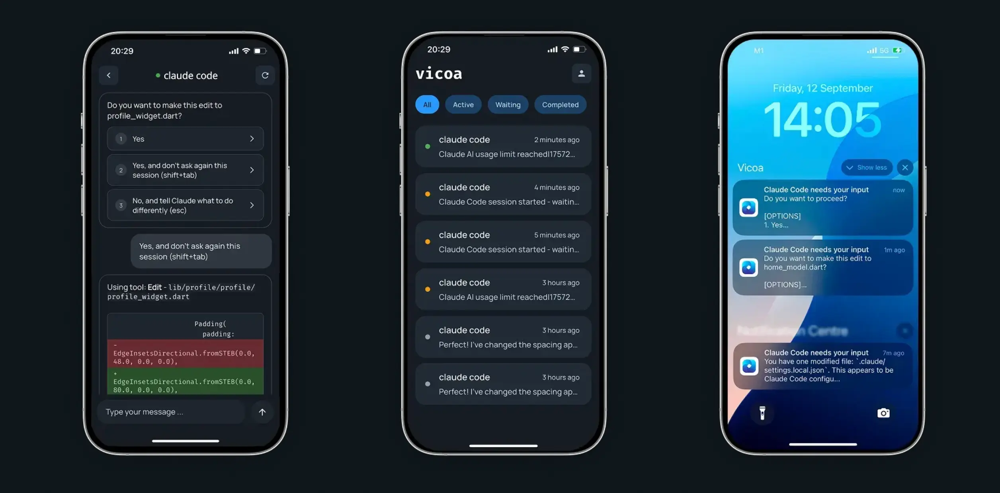

<div align="center">
  
</div>

<div align="center">
  <h1>Vicoa - Vibe Code Anywhere</h1>
</div>

Welcome to the Vicoa community repository! This is the central place for issues, feature requests, discussions, and community engagement for **Vicoa** - the platform that lets you use Claude Code and Codex on any device.

<div align="center">
  
</div>

<div align="center">
  <a href="https://vibecodeanywhere.com">🌐 Website</a> | 
  <a href="https://apps.apple.com/app/id6751626168">📱 iOS App</a> | 
  <a href="https://www.youtube.com/watch?v=ZBpNzqqLYmg">🎥 Demo</a>
</div>

## What is Vicoa?

**Vicoa** (Vibe Code Anywhere) lets you vibe coding seamlessly across your devices.

💻 Start coding with Claude Code on your laptop

📱 Continue on mobile or tablet

🔔 Get notifications when your AI agent needs your input

🌍 Everything stays in sync across devices


### Demo Video

🎥 **Watch Vicoa in Action**

<a href="https://www.youtube.com/watch?v=ZBpNzqqLYmg" target="_blank">
  
</a>


### Key Features

- 💻 **Cross-platform vibe coding** - Start on desktop, continue on mobile
- 📱 **Mobile-first design** - Full coding experience on phones and tablets  
- 🔔 **Smart notifications** - Get alerts when your AI agent needs input
- 🤖 **Original Vibe Coding Experience** - Vibe coding with normal Claude Code and Codex sessions
- 🎯 **Seamless workflow** - Pick up exactly where you left off

## Get Started

- Quick start with a simple command:

```bash
pip install vicoa && vicoa
```

- [📱 Download the iOS App](https://apps.apple.com/app/id6751626168)

- [🌐 Web Dashboard](https://vibecodeanywhere.com)


## Repository Purpose

This repository serves as the community hub for Vicoa web, mobile, and CLI:

- 🐛 Bug reports 
- 💡 Feature requests and suggestions  
- 📚 Documentation
- 💬 Community discussions and support

## How to Contribute

### Reporting Issues

When reporting bugs, please include:

- Platform (Web, iOS, Android, CLI)
- Device/browser information (if open to share)
- Steps to reproduce
- Expected vs actual behavior
- Screenshots or screen recordings if applicable

### Feature Requests

We love hearing your ideas! When suggesting features:

- Describe the problem you're trying to solve
- Explain your proposed solution
- Share any relevant use cases or examples


## Connect With Us

- 📧 **Email**: hi@habitrewards.me
- 🐦 **Twitter**: [@vicoaai](https://x.com/vicoaai)
- 💼 **LinkedIn**: [Vicoa](https://linkedin.com/company/vicoa)
- 🌐 **Website**: [vibecodeanywhere.com](https://vibecodeanywhere.com)

---

Vicoa - Vibe Code Anywhere